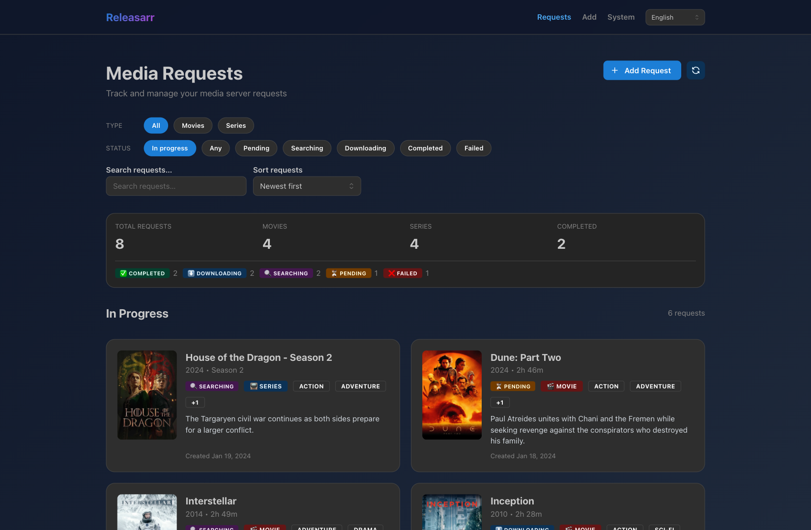
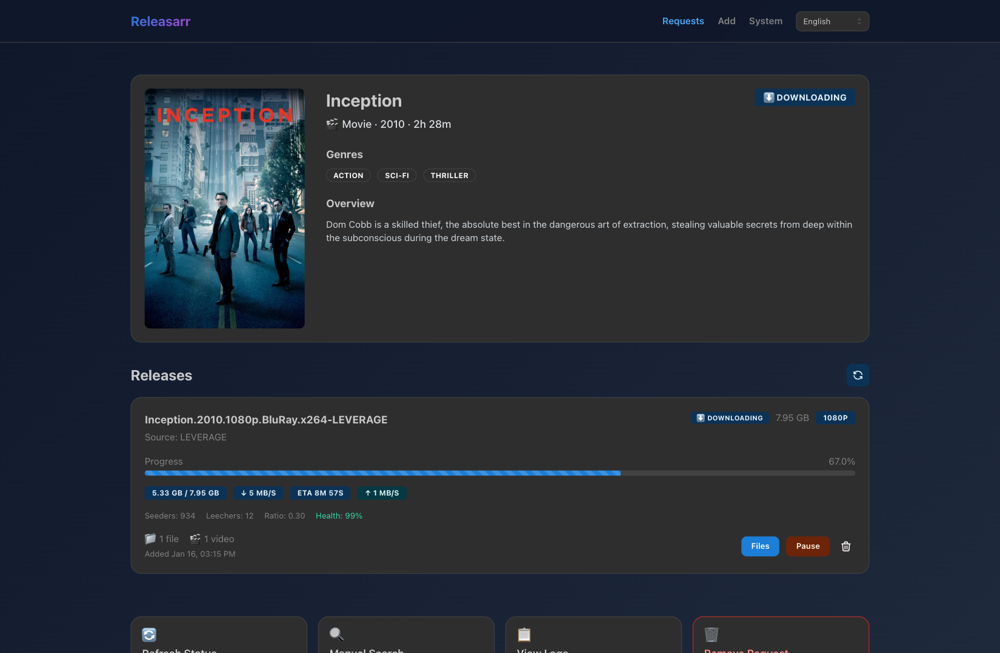
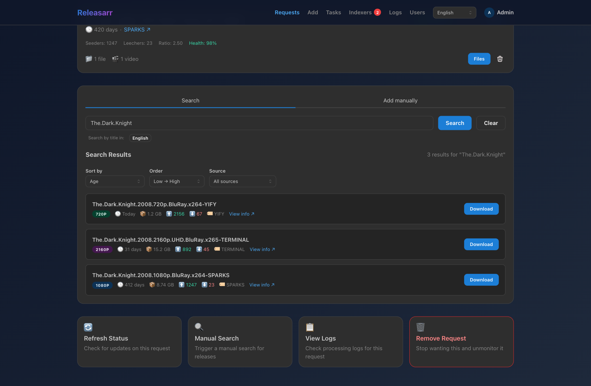
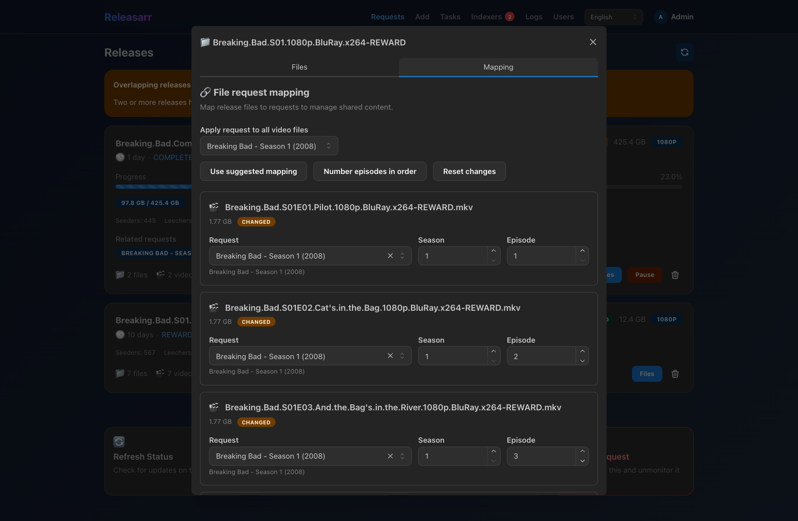
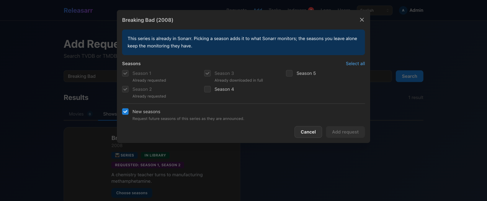
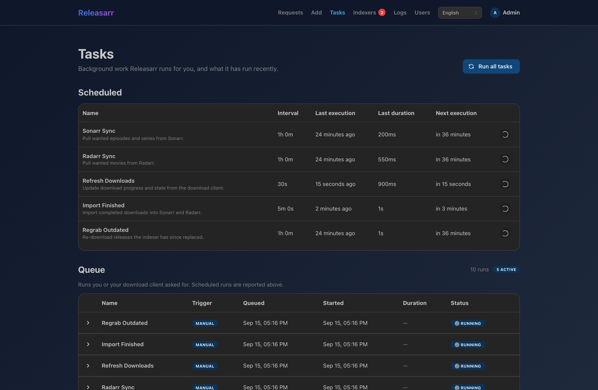

# Releasarr

**A hands-on companion for Sonarr and Radarr: pick the release yourself, map its files to episodes, and let Releasarr import the result back into your library.**

<p align="center">
  
</p>

Sonarr and Radarr are excellent right up to the point where a release does not fit their
assumptions. A season pack numbered by absolute episode, a dual-audio rip from a tracker with
its own naming, a file layout the import parser cannot read — and the automation quietly gives
up, leaving you to shuffle files around by hand.

Releasarr is the manual path, made pleasant. It takes what Sonarr and Radarr report as missing,
searches Prowlarr for it, downloads through qBittorrent, lets you say exactly which file is
which episode, and then hands the result back through Sonarr and Radarr's own manual import.
Your library managers stay the source of truth; Releasarr just handles the awkward middle.

> **Heads up:** this is a personal project, built for one person's setup and shared publicly
> because someone else might find it useful. There is no support promise and no stability
> guarantee — read the code before pointing it at a library you care about.

## Contents

- [Screenshots](#screenshots)
- [What it does](#what-it-does)
- [How a request flows through the system](#how-a-request-flows-through-the-system)
- [Getting started](#getting-started)
- [Configuration](#configuration)
- [Hooking up qBittorrent](#hooking-up-qbittorrent)
- [Development](#development)
- [Architecture](#architecture)
- [Further reading](#further-reading)

## Screenshots

The screenshots below come from the frontend's mock API, so the data is fictional but every
screen is the real UI.

### Following a download

Each request opens onto its releases, with live progress, speeds, seeders, and share ratio
pulled from qBittorrent.



### Choosing a release

Search Prowlarr from inside the request, sorted by age, size, seeders, or leechers, and filtered
by release group. Nothing is grabbed until you say so.



### Mapping files to episodes

The part that makes the rest worthwhile. Every file in a release gets an explicit request,
season, and episode, with bulk-apply, in-order numbering, and server-side suggestions to do the
boring cases for you.



### Adding new media

Search TVDB and TMDB together, then add straight into Sonarr or Radarr. Seasons already in your
library are shown as such, so you only ask for what is genuinely missing.



### Watching the machinery

Every recurring task reports its interval, last run, duration, and next run. Manual and
download-client-triggered runs land in a queue you can expand for per-job output and logs.



## What it does

| Feature | What it means |
| --- | --- |
| **Requests from your library** | Sonarr's missing seasons and Radarr's missing movies are pulled in automatically as requests, enriched with TVDB and TMDB metadata. |
| **Indexer search on demand** | Search Prowlarr per request, or paste a magnet link or upload a `.torrent` yourself. |
| **Download management** | Add, pause, resume, and remove torrents in qBittorrent without leaving the request. |
| **Explicit file mapping** | Say which file is which episode. Suggestions and bulk tools cover the easy cases; you stay in control of the rest. |
| **Import back to the \*arrs** | Finished downloads are handed to Sonarr and Radarr's manual import with absolute paths, and requests close once those apps confirm they hold the media in full. |
| **Repack detection** | Releases the indexer has since replaced are re-downloaded automatically. |
| **Bilingual UI and metadata** | English and Russian, for both the interface and the media titles it searches by. |
| **Operational visibility** | Structured logs, filterable by request or by task, readable from the UI. |

## How a request flows through the system

```
    Sonarr / Radarr                  you                    Prowlarr
   ┌────────────────┐        ┌──────────────────┐        ┌──────────┐
   │ missing season │───────▶│  media request   │───────▶│  search  │
   │ missing movie  │  sync  │                  │  pick  └────┬─────┘
   └────────────────┘        └──────────────────┘             │
           ▲                                                  ▼
           │                                          ┌───────────────┐
           │                                          │  qBittorrent  │
           │                                          └───────┬───────┘
           │                                                  │ progress
           │                     ┌──────────────────┐         ▼
           │                     │   file mapping   │◀── release + files
           │                     │ file → episode   │
           │                     └────────┬─────────┘
           │      manual import           │
           └──────────────────────────────┘
```

Five background tasks keep this moving, all defined in one place and run by a worker process
that is deliberately separate from the web server:

| Task | Default interval | What it does |
| --- | --- | --- |
| `sonarr_sync` | 60m | Import Sonarr's missing seasons as media requests |
| `radarr_sync` | 60m | Import Radarr's missing movies as media requests |
| `release_sync` | 30s | Refresh download progress and state from qBittorrent |
| `export` | 5m | Import finished releases into Sonarr and Radarr |
| `regrab` | 60m | Re-download releases the indexer has since replaced |

The order matters: `export` can only import releases that `release_sync` has already marked
completed.

## Getting started

You will need Docker, plus Sonarr and/or Radarr already running. Prowlarr and qBittorrent are
optional — without them Releasarr falls back to in-memory stubs, which is enough to look around
but not to download anything.

```bash
git clone https://github.com/zxibizz/releasarr.git
cd releasarr
```

Create a `.env` next to `docker-compose.yaml`:

```ini
RELEASARR_API_KEY=pick-something-long

RELEASARR_SONARR_URL=http://sonarr:8989/api/v3
RELEASARR_SONARR_API_KEY=...
RELEASARR_RADARR_URL=http://radarr:7878/api/v3
RELEASARR_RADARR_API_KEY=...

RELEASARR_PROWLARR_URL=http://prowlarr:9696/api/v1
RELEASARR_PROWLARR_API_KEY=...

RELEASARR_QBITTORRENT_URL=http://qbittorrent:8080/api/v2
RELEASARR_QBITTORRENT_USERNAME=admin
RELEASARR_QBITTORRENT_PASSWORD=...

RELEASARR_TVDB_API_KEY=...
RELEASARR_TMDB_API_KEY=...
```

Then bring it up:

```bash
docker compose up -d --build
```

Releasarr is on **http://localhost:8050**. One container runs the whole thing: nginx serves the
frontend and proxies the API under `/api/`, Alembic migrates on boot, and the scheduler worker
runs alongside uvicorn. All three are supervised by s6-overlay, so a process that dies is
restarted on its own, and a failed migration stops the container instead of leaving it half up.
Every line in `docker compose logs` is tagged with the service that wrote it — `[api]`,
`[scheduler]`, or `[nginx]`.

A few things worth knowing before you point it at real data:

- **Releasarr must see the same paths as Sonarr and Radarr.** Imports are handed over as
  absolute filesystem paths, so the download directory qBittorrent reports has to resolve
  identically inside the \*arr containers.
- **The database is a bind-mounted SQLite file** (`services/backend/releasarr.db`). Create it
  before the first run — `touch services/backend/releasarr.db` — or Docker will make a
  directory in its place. Set
  `RELEASARR_DATABASE_URL` to a `postgresql+asyncpg://` URL to use Postgres instead.
- **Everything except the health probes needs `X-API-Key`.** The default is `dev-secret`; change
  it.

## Configuration

All backend settings are read from the environment with a `RELEASARR_` prefix, or from a `.env`
file. The defaults below are what you get if you set nothing.

### Core

| Variable | Default | Description |
| --- | --- | --- |
| `RELEASARR_API_KEY` | `dev-secret` | Required `X-API-Key` value on every non-probe endpoint |
| `RELEASARR_DATABASE_URL` | `sqlite+aiosqlite:///./releasarr.db` | Async SQLAlchemy URL; `postgresql+asyncpg://…` also works |
| `RELEASARR_API_HOST` | `0.0.0.0` | Uvicorn bind host |
| `RELEASARR_API_PORT` | `8001` | Uvicorn bind port when run directly (the image uses 8000 behind nginx) |
| `RELEASARR_LOG_LEVEL` | `INFO` | Console log level; the file sink always keeps at least INFO |
| `RELEASARR_LOG_JSON` | `false` | Emit JSON logs |
| `RELEASARR_LOG_FILE` | `.logs/backend.log` | The API process's log file, rotated at 10 MB |
| `RELEASARR_SCHEDULER_LOG_FILE` | `.logs/scheduler.log` | The scheduler's own log file, rotated the same way |
| `RELEASARR_LOG_HISTORY_FILES` | `3` | How many rotated files the logs view reaches back through in each file |
| `RELEASARR_DEFAULT_PAGE_SIZE` | `20` | Default page size |
| `RELEASARR_MAX_PAGE_SIZE` | `100` | Largest page size a client may ask for |

### Sonarr and Radarr

| Variable | Default | Description |
| --- | --- | --- |
| `RELEASARR_SONARR_URL` | `http://localhost:8989/api/v3` | Sonarr API base URL |
| `RELEASARR_SONARR_API_KEY` | *(empty)* | Sonarr API key |
| `RELEASARR_RADARR_URL` | `http://localhost:7878/api/v3` | Radarr API base URL |
| `RELEASARR_RADARR_API_KEY` | *(empty)* | Radarr API key |
| `RELEASARR_SONARR_QUALITY_PROFILE_ID` | *(first reported)* | Profile used when adding a series |
| `RELEASARR_RADARR_QUALITY_PROFILE_ID` | *(first reported)* | Profile used when adding a movie |

Sonarr and Radarr refuse an add without a quality profile even though Releasarr never grabs by
one, so the first profile they report is used unless you pick one.

### Metadata providers

| Variable | Default | Description |
| --- | --- | --- |
| `RELEASARR_TVDB_API_KEY` | *(empty)* | TVDB v4 API key, for series metadata |
| `RELEASARR_TMDB_API_KEY` | *(empty)* | TMDB API key, for movie metadata |
| `RELEASARR_TVDB_BASE_URL` | `https://api4.thetvdb.com/v4` | TVDB API base |
| `RELEASARR_TMDB_BASE_URL` | `https://api.themoviedb.org/3` | TMDB API base |
| `RELEASARR_METADATA_LANGUAGES` | `("eng", "rus")` | Languages to fetch titles and overviews in |

### Prowlarr

| Variable | Default | Description |
| --- | --- | --- |
| `RELEASARR_PROWLARR_URL` | *(empty — search is stubbed)* | Prowlarr API base, including the `/api/v1` suffix |
| `RELEASARR_PROWLARR_API_KEY` | *(empty)* | Prowlarr API key |
| `RELEASARR_PROWLARR_CATEGORIES` | *(all)* | Indexer category IDs to restrict searches to |
| `RELEASARR_PROWLARR_TIMEOUT` | `20.0` | Request timeout in seconds |

### qBittorrent

| Variable | Default | Description |
| --- | --- | --- |
| `RELEASARR_QBITTORRENT_URL` | *(empty — downloads are stubbed)* | qBittorrent Web API base, including the `/api/v2` suffix |
| `RELEASARR_QBITTORRENT_USERNAME` | *(empty)* | Web UI username |
| `RELEASARR_QBITTORRENT_PASSWORD` | *(empty)* | Web UI password |
| `RELEASARR_QBITTORRENT_SAVE_PATH` | *(client default)* | Override where torrents are saved |
| `RELEASARR_QBITTORRENT_CATEGORY` | *(none)* | Category to add torrents under |
| `RELEASARR_QBITTORRENT_TAG_PREFIX` | *(none)* | Prefix for tags applied to Releasarr's torrents |
| `RELEASARR_QBITTORRENT_PAUSED` | `false` | Add torrents paused |
| `RELEASARR_QBITTORRENT_TIMEOUT` | `15.0` | Request timeout in seconds |

## Hooking up qBittorrent

By default a finished torrent waits up to five minutes for the next export run. Point
qBittorrent at Releasarr instead and it gets imported immediately. In **Options → Downloads →
Run external program on torrent finished**:

```bash
curl -fsS -X POST -H "X-API-Key: your-api-key" http://releasarr/api/tasks/sync_downloads
```

`releasarr` here is the container name on a shared Docker network, where nginx listens on port
80; from outside, use the published port instead (`http://your-host:8050/api/…`). Either way the
`/api` prefix is what nginx serves the API under.

`sync_downloads` queues only `release_sync` and `export` — a full sync on every torrent would
hammer Sonarr, Radarr, the metadata providers, and your indexers for no reason. Runs arriving
this way show up in the queue on **System → Tasks**, tagged with the download client as their
trigger.

## Development

The two halves run independently, and the frontend ships with a mock API so you can work on the
UI without a backend, a library, or a tracker.

### Frontend

```bash
cd services/frontend
npm install
npm run dev:mock
```

That starts an Express mock of the OpenAPI contract on port 8001 and the Vite dev server on
port 3000. Open http://localhost:3000. All the screenshots in this README were taken against
it.

| Script | Purpose |
| --- | --- |
| `npm run dev:mock` | Dev server plus mock API |
| `npm run dev` | Dev server only, against `VITE_API_URL` |
| `npm test` | Vitest suite |
| `npm run lint` | ESLint |
| `npm run codegen` | Regenerate API types from `openapi.yaml` |

### Backend

```bash
cd services/backend
uv sync
uv run alembic upgrade head
uv run fastapi dev src/api/app.py
```

The scheduler is a separate process, by design — nothing recurring runs inside the web server:

```bash
uv run python -m src.tasks.cli scheduler
```

Individual tasks can also be run once from the CLI, which is handy when debugging a sync:

```bash
uv run python -m src.tasks.cli sync-sonarr-requests
uv run python -m src.tasks.cli sync-radarr-requests
uv run python -m src.tasks.cli sync-releases
uv run python -m src.tasks.cli release-summary --json
```

| Command | Purpose |
| --- | --- |
| `uv run pytest` | Test suite |
| `uv run ruff check ./src` | Lint (what CI runs) |
| `uv run ruff format ./src` | Format |
| `uv run mypy src` | Type check |

### Both halves in Docker

If you would rather not install Python and Node locally, there is a development stack that
reloads on edit:

```bash
docker compose -f docker-compose.dev.yaml up --build
```

The UI is on **http://localhost:3000** and the API on **http://localhost:8000**, with the
scheduler in its own container as in production. Source is bind-mounted, so host edits reload in
place — uvicorn's `--reload` for the API, watchfiles for the scheduler, Vite's HMR for the UI.
Only a dependency change needs `--build` again. Vite proxies `/api` to the backend, the same
prefix nginx serves it under in production, so the browser stays on a single origin.

Two things it shares with the production stack: the same `.env`, and the same
`services/backend/releasarr.db`. Bringing it up starts syncing against whichever Sonarr, Radarr, and
Prowlarr that file points at.

## Architecture

[`openapi.yaml`](openapi.yaml) is the contract, and both sides are generated from or checked
against it: the frontend's types come from `npm run codegen`, and the backend has contract tests
that compare its routes to the spec. The mock API implements the same document, which is why
UI work against mocks stays honest.

The backend is layered, with dependencies pointing inward:

```
api/             FastAPI routers, auth, error handling — no business logic
application/
  use_cases/     One class per operation: requests, releases, discover, tasks, logs
  interfaces/    Protocols the use cases depend on
  utility/       Torrent name parsing, file matching, localization
infrastructure/  The implementations: Sonarr, Radarr, Prowlarr, qBittorrent, TVDB,
                 TMDB, SQLAlchemy repositories, log file reading
domain/          SQLAlchemy entities and enums
tasks/           Standalone task runners, the scheduler worker, and a Typer CLI
core/            Dependency-injection container and Loguru setup
```

Two consequences worth calling out. Integrations are addressed through protocols, so an absent
Prowlarr or qBittorrent degrades to an in-memory stub rather than a crash. And the scheduler
lives outside the ASGI app entirely: the API only ever writes rows to `sync_jobs`, and the
worker claims them within a few seconds.

The frontend is feature-sliced — `requests`, `releases`, `discover`, `tasks`, `logs` — with each
feature owning its API calls and its React Query keys, and a single `apiRequest` wrapper as the
only place HTTP happens. Route loaders warm the query cache so pages have data on first paint.

### Stack

| Layer | Choices |
| --- | --- |
| **Backend** | Python 3.12, FastAPI, SQLAlchemy 2.0 async, Alembic, Pydantic 2, httpx, Loguru, Typer, `uv` |
| **Frontend** | React 19, Vite, TypeScript, Mantine 9, TanStack Query 5, React Router 7, i18next |
| **Storage** | SQLite by default, PostgreSQL via `asyncpg` |
| **Packaging** | One Docker image: s6-overlay supervising nginx + uvicorn + scheduler worker |

## Further reading

- [`docs/`](docs/README.md) — developer documentation: architecture, backend and frontend conventions, data model, testing
- [`AGENTS.md`](AGENTS.md) — the short orientation, and the rules that matter most when changing this code
- [`openapi.yaml`](openapi.yaml) — the API contract
- [`services/backend/docs/tasks.md`](services/backend/docs/tasks.md) — background tasks, the scheduler, job queueing, and log filtering in detail
- [`services/frontend/README.md`](services/frontend/README.md) — frontend conventions and the file mapping internals
